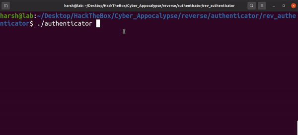
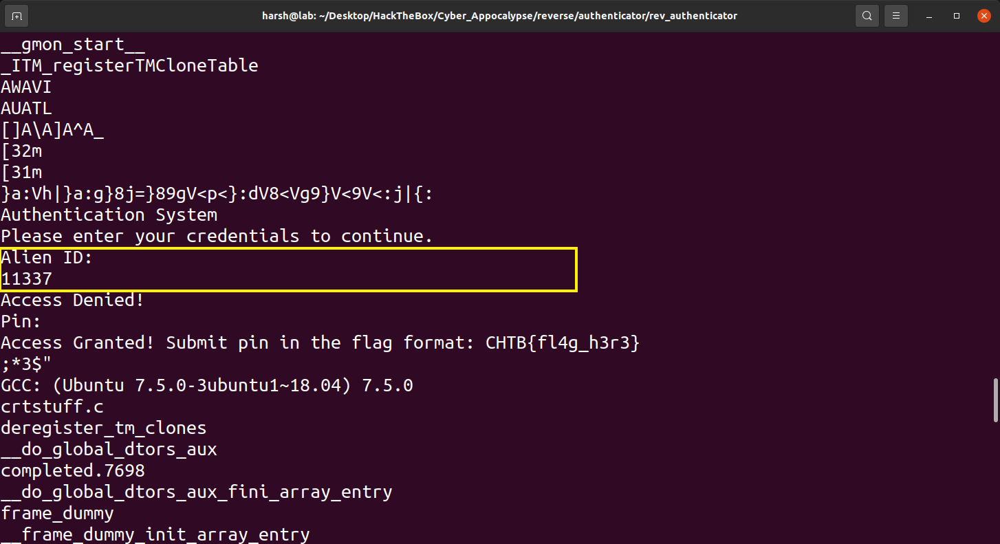
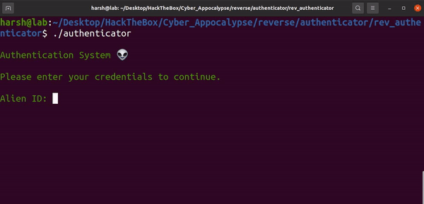
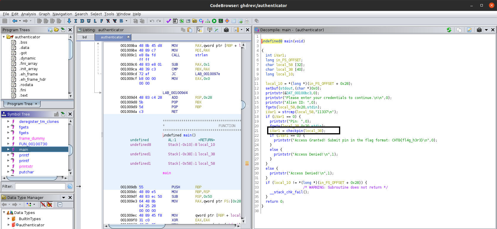

# Authenticator ⚠
We were given a ELF64 binary which required a pin.



## Solution
This challenge seemed easy initially as it asked for an alien ID and running `strings` on the binary gave us the ID.



*Also, just to be sure I ran `ltrace` on it and confirmed the ID.*


After entering the ID it asked for a PIN. 



I repeaded the `strings` and `ltarce` commands but this time I did not find anything. So, I opened `gdb` and tried to debug the program. Ultimately I found the flag but believe be this was very tedious task. So, instead of `gdb`, I fired up `Ghidra`.

*After loading the file in `Ghidra`, I opened `main` function and ghidra decompiled it for me :* 



*As we can see the decompiled code, it checks our previously found ID and then calls a function called `checkpin`. So I go to the `checkpin` function's defination.*


*We can see that the each byte of the string is being XOR'd with "9". So I created a simple python script :*

```python
x = "}a:Vh|}a:g}8j=}89gV<p<}:dV8<Vg9}V<9V<:j|{:"
k = 9
ans = ""
for i in x:
	ans += chr(ord(i) ^ k)
print(ans)
```

This gave me *th3_auth3nt1c4t10n_5y5t3m_15_n0t_50_53cur3*

> **Flag** : _CHTB{th3_auth3nt1c4t10n_5y5t3m_15_n0t_50_53cur3}_

